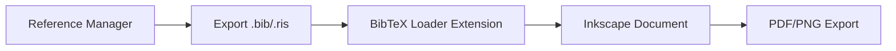

Collecting workspace information# BibTeX/Reference Loader for Inkscape

[](https://inkscape.org/)
[](https://www.python.org/)
[](LICENSE)

> **Automatically format and insert academic references into your Inkscape drawings**

A powerful Inkscape extension that loads reference files (BibTeX, RIS, JSON, EndNote) and adds beautifully formatted citations to your scientific posters, presentations, and diagrams. Supports multiple citation styles (APA, MLA, Chicago, IEEE, Nature, and more).

---

## 📋 Table of Contents

- Features
- Installation
- Quick Start
- Usage Guide
- Citation Styles
- File Formats
- Customization
- Troubleshooting
- Advanced Features
- Contributing

---

## ✨ Features

- **📚 Multiple Format Support**
  - BibTeX (`.bib`)
  - RIS (`.ris`)
  - JSON/CSL JSON (`.json`)
  - EndNote (`.enw`, `.endnote`)

- **🎨 Citation Styles**
  - APA (7th edition)
  - MLA
  - Chicago
  - Harvard
  - IEEE
  - Vancouver
  - AMA (American Medical Association)
  - ACS (American Chemical Society)
  - Nature

- **⚙️ Flexible Formatting**
  - Multiple numbering styles (numeric, alphabetic, roman, symbols)
  - Hanging indent support
  - Customizable fonts and spacing
  - Optional background box
  - Auto text wrapping

- **🔄 Smart Features**
  - Update existing references in place
  - Automatic sorting (by author, year, title, or appearance)
  - Flexible positioning (center, corners, custom)

---

## 📦 Installation

### Step 1: Locate Your Inkscape Extensions Directory

**Windows:**
```
C:\Users\[YourUsername]\AppData\Roaming\inkscape\extensions\
```

**macOS:**
```
~/Library/Application Support/org.inkscape.Inkscape/config/inkscape/extensions/
```

**Linux:**
```
~/.config/inkscape/extensions/
```

> **Tip:** In Inkscape, go to **Edit → Preferences → System** to find your extensions directory.

### Step 2: Install the Extension

1. **Download the extension files:**
   - bibtex_loader.py
   - bibtex_loader.inx

2. **Create the extension folder:**
   ```bash
   mkdir -p [extensions-directory]/load_refs
   ```

3. **Copy files to the folder:**
   ```bash
   cp bibtex_loader.py [extensions-directory]/load_refs/
   cp bibtex_loader.inx [extensions-directory]/load_refs/
   ```

4. **Make the script executable** (Linux/macOS):
   ```bash
   chmod +x [extensions-directory]/load_refs/bibtex_loader.py
   ```

5. **Restart Inkscape**

### Step 3: Verify Installation

Open Inkscape and check: **Extensions → References → BibTeX/Reference Loader**

---

## 🚀 Quick Start

### Basic Example

1. **Open your document in Inkscape**
2. Go to **Extensions → References → BibTeX/Reference Loader**
3. **Select your reference file** (e.g., `references.bib`)
4. **Choose citation style** (e.g., APA)
5. Click **Apply**

**Result:**
```
References

[1] Smith, J. A., & Doe, J. B. (2023). Machine Learning Methods. 
    Journal of AI Research, 45(2), 123-145.

[2] Johnson, M. K. (2022). Deep Neural Networks. MIT Press.
```

---

## 📖 Usage Guide

### File Tab

| Option | Description |
|--------|-------------|
| **Reference File** | Path to your `.bib`, `.ris`, `.json`, or `.enw` file |
| **Citation Style** | Choose from 9 academic styles |
| **Font Family** | Select font (serif, sans-serif, Arial, Times, etc.) |
| **Font Size** | Base text size (default: 11pt) |

### Format Tab

| Option | Description |
|--------|-------------|
| **Numbering Style** | Numeric `[1]`, Alphabetic `a.`, Roman `i.`, Bullets, etc. |
| **Sort Order** | By author, year, title, or appearance |
| **Line Spacing** | Vertical space between references (default: 1.3) |
| **Hanging Indent** | First line flush left, subsequent lines indented |
| **Indent Size** | Pixels for hanging indent (default: 20px) |

### Layout Tab

| Option | Description |
|--------|-------------|
| **Max Width** | Maximum text width in pixels (default: 600px) |
| **Show Title** | Display "References" heading |
| **Title Text** | Customize heading (e.g., "Bibliography", "Works Cited") |
| **Add Background Box** | Optional white box behind text |
| **Box Padding** | Space around text in box (default: 15px) |

### Position Tab

| Option | Description |
|--------|-------------|
| **Position Mode** | Center, Top-left, Bottom-right, or Custom |
| **X Position** | Horizontal position (custom mode) |
| **Y Position** | Vertical position (custom mode) |

### Options Tab

| Option | Description |
|--------|-------------|
| **Update Existing** | Replace previous references in document |

---

## 🎓 Citation Styles

### APA (American Psychological Association)
```
Smith, J. A., & Doe, J. B. (2023). Machine learning methods. 
    Journal of AI Research, 45(2), 123-145.
```

### MLA (Modern Language Association)
```
Smith, Jane A., and John B. Doe. "Machine Learning Methods." 
    Journal of AI Research, vol. 45, no. 2, 2023, pp. 123-145.
```

### Chicago (Author-Date)
```
Smith, Jane A., and John B. Doe. 2023. "Machine Learning Methods." 
    Journal of AI Research 45, no. 2: 123-145.
```

### IEEE
```
J. A. Smith and J. B. Doe, "Machine learning methods," Journal 
    of AI Research, vol. 45, no. 2, pp. 123-145, 2023.
```

### Nature
```
Smith JA, Doe JB. Machine learning methods. Journal of AI 
    Research 45, 123-145 (2023).
```

### Vancouver (Medical)
```
Smith JA, Doe JB. Machine learning methods. J AI Res. 2023;45(2):123-145.
```

---

## 📄 File Formats

### BibTeX (.bib)

```bibtex
@article{smith2023machine,
  author = {Jane A. Smith and John B. Doe},
  title = {Machine Learning Methods},
  journal = {Journal of AI Research},
  year = {2023},
  volume = {45},
  number = {2},
  pages = {123--145}
}

@book{johnson2022deep,
  author = {Michael K. Johnson},
  title = {Deep Neural Networks},
  publisher = {MIT Press},
  year = {2022}
}
```

### RIS (.ris)

```
TY  - JOUR
AU  - Smith, Jane A.
AU  - Doe, John B.
TI  - Machine Learning Methods
JO  - Journal of AI Research
PY  - 2023
VL  - 45
IS  - 2
SP  - 123
EP  - 145
ER  -
```

### JSON/CSL (.json)

```json
[
  {
    "id": "smith2023",
    "type": "article-journal",
    "author": [
      {"given": "Jane A.", "family": "Smith"},
      {"given": "John B.", "family": "Doe"}
    ],
    "title": "Machine Learning Methods",
    "container-title": "Journal of AI Research",
    "issued": {"date-parts": [[2023]]},
    "volume": "45",
    "issue": "2",
    "page": "123-145"
  }
]
```

### EndNote (.enw)

```
%0 Journal Article
%A Smith, Jane A.
%A Doe, John B.
%T Machine Learning Methods
%J Journal of AI Research
%D 2023
%V 45
%N 2
%P 123-145
```

---

## 🎨 Customization

### Numbering Styles

Choose from multiple numbering options:

| Style | Example |
|-------|---------|
| **Numeric** | `[1]`, `[2]`, `[3]` |
| **Numeric Dot** | `1.`, `2.`, `3.` |
| **Numeric Parenthesis** | `(1)`, `(2)`, `(3)` |
| **Alphabetic** | `a.`, `b.`, `c.` |
| **Roman** | `i.`, `ii.`, `iii.` |
| **Symbols** | `*`, `†`, `‡`, `§` |
| **Bullet** | `•` (all items) |
| **None** | No markers |

### Hanging Indent Example

**Without Hanging Indent:**
```
[1] Smith, J. A., & Doe, J. B. (2023). Machine Learning 
Methods with Very Long Titles That Wrap to Multiple Lines. 
Journal of AI Research, 45(2), 123-145.
```

**With Hanging Indent:**
```
[1] Smith, J. A., & Doe, J. B. (2023). Machine Learning 
    Methods with Very Long Titles That Wrap to Multiple Lines. 
    Journal of AI Research, 45(2), 123-145.
```

### Font Families

Available font options:
- **Serif** (default)
- **Sans-serif**
- **Times New Roman**
- **Arial**
- **Helvetica**
- **Georgia**
- **Palatino**
- **Garamond**
- **Courier** (monospace)
- **Verdana**
- **Trebuchet MS**

---

## 🛠️ Dependencies

### Core Requirements

| Component | Version | Purpose |
|-----------|---------|---------|
| **Inkscape** | 1.0+ | Vector graphics editor |
| **Python** | 3.6+ | Extension runtime |
| **lxml** | Latest | XML parsing |

**Installation:**
```bash
# Python and lxml usually pre-installed with Inkscape
# If needed:
pip install lxml
```

### Supported Reference Managers

- **Zotero** (export as BibTeX, RIS, or JSON)
- **Mendeley** (export as BibTeX or RIS)
- **EndNote** (export as EndNote or RIS)
- **Papers** (export as BibTeX)
- **RefWorks** (export as RIS)
- **JabRef** (native BibTeX)

---

## 🐛 Troubleshooting

### Common Issues

<details>
<summary><b>Extension not appearing in menu</b></summary>

**Solution:**
1. Check file locations:
   ```bash
   ls [extensions-directory]/load_refs/
   # Should show: bibtex_loader.py, bibtex_loader.inx
   ```
2. Verify permissions:
   ```bash
   chmod +x bibtex_loader.py
   ```
3. Check Inkscape error log:
   - **Edit → Preferences → System → View Error Log**
4. Restart Inkscape completely

</details>

<details>
<summary><b>File not loading</b></summary>

**Error:** "Please provide a valid reference file path"

**Solutions:**
1. Use full absolute path: `C:\Users\Name\Documents\refs.bib`
2. Check file exists and has correct extension
3. Ensure file is not corrupted
4. Try opening file in text editor to verify format

</details>

<details>
<summary><b>Formatting issues</b></summary>

**Text too wide:**
- Reduce "Max Width" (default: 600px)
- Decrease font size

**Text overlapping:**
- Increase "Line Spacing" (default: 1.3)
- Adjust Y position

**Hanging indent not working:**
- Ensure "Use Hanging Indent" is checked
- Increase "Indent Size" (try 30-40px)

</details>

<details>
<summary><b>Authors not parsing correctly</b></summary>

**BibTeX format requirements:**
- Separate authors with `and`: `author = {Smith, J. and Doe, J.}`
- Use proper braces: `author = {Jane Smith and John Doe}`

**RIS format:**
- Each author on separate line:
  ```
  AU  - Smith, Jane
  AU  - Doe, John
  ```

</details>

<details>
<summary><b>Update existing not working</b></summary>

**Solution:**
1. Ensure previous references were created by this extension
2. Check "Update Existing References" is enabled
3. Extension looks for groups with ID starting with "references"
4. If not working, manually delete old references first

</details>

---

## 📊 Examples

### Scientific Poster

```
Settings:
- Citation Style: Nature
- Numbering: Numeric [1]
- Font: Arial, 10pt
- Hanging Indent: Yes
- Position: Bottom-left
```

**Output:**
```
References

[1] Watson JD, Crick FH. Molecular structure of nucleic acids. 
    Nature 171, 737-738 (1953).

[2] Franklin R, Gosling RG. Evidence for 2-chain helix in 
    crystalline structure of sodium deoxyribonucleate. Nature 
    172, 156-157 (1953).
```

### Literature Review Diagram

```
Settings:
- Citation Style: APA
- Numbering: None
- Font: Times New Roman, 11pt
- Background Box: Yes
- Position: Center
```

### Engineering Report

```
Settings:
- Citation Style: IEEE
- Numbering: [1], [2]
- Font: Sans-serif, 9pt
- Sort: Appearance order
- Position: Top-right
```

---

## 🎯 Advanced Features

### Batch Processing

Create multiple reference lists from different files:

1. Create first list with `references.bib`
2. Position it on the page
3. Run extension again with `additional_refs.bib`
4. Position second list elsewhere

### Custom Sorting

Sort references by:
- **Appearance**: Order they appear in source file
- **Author**: Alphabetically by first author's last name
- **Year**: Chronologically (newest or oldest first)
- **Title**: Alphabetically by publication title

### Integration with Text

1. Insert references at bottom of poster
2. Add text elements above with inline citations: `(Smith & Doe, 2023)`
3. Use consistent numbering style

### Export Workflow



---

## 📝 Tips and Best Practices

1. **File Management**
   - Keep reference files in same folder as Inkscape document
   - Use descriptive filenames: `poster_references.bib`
   - Back up reference files regularly

2. **Styling Consistency**
   - Choose citation style based on field (APA for psychology, IEEE for engineering)
   - Keep font size readable (9-11pt for posters)
   - Use consistent numbering across all figures

3. **Text Width**
   - Max width 600px works well for A4/Letter
   - For posters: 800-1000px
   - For presentations: 400-600px

4. **Position Planning**
   - Leave space for references when designing layout
   - Bottom of page is conventional
   - Consider multi-column layouts for many refs

5. **Testing**
   - Test with small reference file first
   - Verify formatting before final export
   - Check text wrapping and alignment

---

## 🔧 Customizing the Extension

### Modify Font Mapping

Edit line 664 in bibtex_loader.py:

```python
def get_font_family(self):
    font_map = {
        'serif': 'serif',
        'custom': 'My Custom Font, serif',  # Add your font
        # ...
    }
```

### Add Custom Citation Style

Add to bibtex_loader.py after line 457:

```python
def format_custom(self, entry_type, authors, year, title, fields):
    """My custom citation style."""
    parts = []
    # Add your formatting logic
    parts.append(f"{authors} ({year}). {title}.")
    return ' '.join(parts)
```

Then update line 430 to include your style:

```python
elif style == 'custom':
    return self.format_custom(entry_type, authors, year, title, fields)
```

---

## 🤝 Contributing

Contributions welcome! Please:

1. Fork the repository
2. Create feature branch (`git checkout -b feature/amazing-feature`)
3. Commit changes (`git commit -m 'Add custom style'`)
4. Push to branch (`git push origin feature/amazing-feature`)
5. Open Pull Request

**Development Setup:**
```bash
git clone https://github.com/yourusername/bibtex-loader.git
cd bibtex-loader
# Symlink to extensions directory for testing
ln -s $(pwd) ~/.config/inkscape/extensions/load_refs
```

---

## 📄 License

This project is licensed under the MIT License - see LICENSE file for details.

---

## 📧 Support

- **Issues**: [GitHub Issues](https://github.com/YouvenZ/bibtex-loader/issues)
- **Discussions**: [GitHub Discussions](https://github.com/YouvenZ/bibtex-loader/discussions)
- **Documentation**: [Wiki](https://github.com/YouvenZ/bibtex-loader/wiki)

---

## 🔄 Changelog

### v1.0.0 (2024-01-15)
- ✨ Initial release
- ✅ Support for BibTeX, RIS, JSON, EndNote formats
- ✅ 9 citation styles (APA, MLA, Chicago, IEEE, Nature, Vancouver, AMA, ACS, Harvard)
- ✅ Multiple numbering styles
- ✅ Hanging indent support
- ✅ Update existing references
- ✅ Flexible positioning
